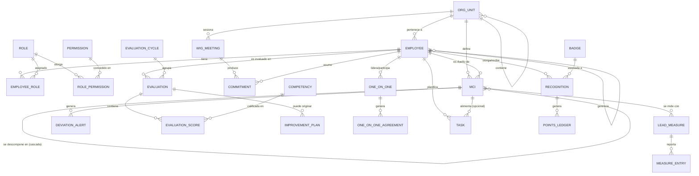

# Franklin Covey ILP
## Especificación Funcional y Técnica Completa

**Metodología base:** FranklinCovey (4DX, Administración por Prioridades, Liderazgo Centrado en Principios)
**Stack objetivo:** React, Next.js, Node.js, PostgreSQL, Azure
**Alcance geográfico de referencia:** operación multi-país (matriz corporativa + oficinas regionales), con áreas funcionales centrales y coordinadores regionales por país — el modelo de datos y permisos está diseñado para soportar esta topología desde el día uno.

---

## 0. Resumen ejecutivo

Franklin Covey ILP (PEP) es un sistema de gestión de talento humano que convierte la metodología FranklinCovey en software operativo: no es un ERP de RRHH genérico con un módulo de "objetivos" pegado encima, sino una plataforma cuyo modelo de datos central *es* el ciclo 4DX (MCI → Lead Measures → Tablero → Rendición de cuentas), con la administración de personal, desempeño, tiempo y reconocimiento orbitando alrededor de ese núcleo.

Tres decisiones de arquitectura se derivan directamente de esto:

1. **El "MCI" (o "MCI" — Meta Crucialmente Importante) es una entidad de primer orden**, no un campo dentro de "objetivos". Tiene jerarquía (corporativo → departamental → individual), cadencia de medición propia, y un ciclo de vida independiente del ciclo de evaluación de desempeño.
2. **La organización se modela como una jerarquía multi-nivel de unidades**, no como "departamento plano". Esto permite que una corporación con una casa matriz y operaciones regionales en varios países configure su propio árbol (país → área funcional o coordinación regional → equipo) sin tocar código.
3. **La cadencia (semanal, quincenal, mensual) es un ciudadano de primera clase del sistema**, no un cron job oculto. Reuniones MCI, seguimiento de lead measures y one-on-ones se generan y versionan como instancias de una cadencia configurable por unidad organizacional.

---

## 1. Arquitectura del sistema

### 1.1 Estilo arquitectónico

**Monolito modular** para el MVP, con fronteras de módulo lo suficientemente limpias (por *bounded context*) para extraerlos a servicios independientes en la fase Enterprise si el volumen lo exige. Esto evita la complejidad operativa de microservicios prematuros mientras se preserva la opción de escalar horizontalmente los módulos más pesados (Notificaciones, IA/Analítica, Reportes).

```
┌─────────────────────────────────────────────────────────────────┐
│                        CLIENTE (Web + Mobile Web)                │
│         Next.js 14 (App Router) · React 18 · Tailwind CSS        │
└───────────────────────────────┬───────────────────────────────────┘
                                 │ HTTPS / JSON / WebSocket (notif.)
┌───────────────────────────────▼───────────────────────────────────┐
│                          API GATEWAY (Azure APIM)                 │
│         Rate limiting · Auth (Azure AD B2C / JWT) · Routing       │
└───────────────────────────────┬───────────────────────────────────┘
                                 │
┌────────────────────────────────────────────────────────────────────┐
│                 BACKEND — Node.js (NestJS) — Monolito Modular      │
│                                                                      │
│  ┌────────────┐ ┌────────────┐ ┌────────────┐ ┌──────────────────┐ │
│  │  IAM /     │ │  Personas  │ │  4DX /     │ │  Desempeño /      │ │
│  │  Org Tree  │ │  (Expedie- │ │  Objetivos │ │  Evaluaciones     │ │
│  │            │ │  nte)      │ │            │ │                   │ │
│  └────────────┘ └────────────┘ └────────────┘ └──────────────────┘ │
│  ┌────────────┐ ┌────────────┐ ┌────────────┐ ┌──────────────────┐ │
│  │  Reuniones │ │  Gestión   │ │  Desarrollo│ │  Reconocimiento   │ │
│  │  MCI / 1:1 │ │  del       │ │  de        │ │                   │ │
│  │            │ │  Tiempo    │ │  Talento   │ │                   │ │
│  └────────────┘ └────────────┘ └────────────┘ └──────────────────┘ │
│  ┌────────────┐ ┌──────────────────────────┐ ┌──────────────────┐  │
│  │  Reportes  │ │  Motor de IA / Insights   │ │  Notificaciones   │  │
│  │  (BI layer)│ │  (orquestador + Claude)   │ │  (email/push/WS)  │  │
│  └────────────┘ └──────────────────────────┘ └──────────────────┘  │
│                                                                      │
│         Event Bus interno (Azure Service Bus) — desacopla           │
│         módulos vía eventos de dominio (ver 1.3)                    │
└──────────────────────────────┬───────────────────────────────────────┘
                                │
     ┌──────────────────────────┼──────────────────────────────┐
     ▼                          ▼                              ▼
┌──────────────┐      ┌──────────────────┐         ┌─────────────────────┐
│  PostgreSQL   │      │  Azure Blob       │         │  Azure Cognitive     │
│  (Flexible    │      │  Storage          │         │  Search /            │
│  Server)      │      │  (contratos,      │         │  Redis (caché de     │
│  + PgBouncer  │      │  evidencias,      │         │  dashboards y        │
│  + réplica     │      │  insignias)       │         │  sesiones)           │
│  de lectura   │      │                   │         │                       │
└──────────────┘      └──────────────────┘         └─────────────────────┘
```

### 1.2 Módulos y sus fronteras (bounded contexts)

| Módulo | Responsabilidad | Depende de |
|---|---|---|
| **IAM / Org Tree** | Autenticación, roles, permisos, estructura organizacional jerárquica (país → área/coordinación → equipo) | — (núcleo) |
| **Personas** | Expediente digital, organigrama visual, historial laboral, contratos, vacaciones, permisos, capacitación básica | IAM |
| **4DX / Objetivos** | MCIs corporativos/departamentales/individuales, Lead/Lag measures, tablero de resultados, alertas de desviación | IAM, Personas |
| **Reuniones MCI** | Agenda, compromisos semanales, histórico, próximas acciones | 4DX |
| **Desempeño** | Evaluaciones 90/180/360, competencias, valores, feedback continuo, PDI de mejora | Personas, 4DX |
| **One-on-One** | Reuniones líder-colaborador, acuerdos, seguimiento | Personas, Desempeño |
| **Gestión del Tiempo** | Matriz de Covey, planificación semanal, agenda, recordatorios | IAM |
| **Desarrollo de Talento** | PID, cursos, certificaciones, mentoring, coaching | Personas, Desempeño |
| **Reconocimiento** | Kudos entre pares, insignias, puntos, muro de logros | Personas |
| **Reportes / BI** | Agregación read-only sobre los demás módulos, exportación | Todos (solo lectura) |
| **IA / Insights** | Orquesta llamadas al modelo, expone recomendaciones a los demás módulos vía API interna | Todos (solo lectura) |
| **Notificaciones** | Email, push, WebSocket; consume eventos de dominio | Event Bus |

### 1.3 Comunicación entre módulos

Dentro del monolito, los módulos **no se llaman entre sí directamente** salvo lecturas explícitas documentadas en la tabla anterior. La escritura entre módulos ocurre por **eventos de dominio** publicados en un bus interno (in-process en MVP, Azure Service Bus en Enterprise):

- `mci.created`, `mci.progress_updated`, `mci.at_risk`
- `evaluation.completed`, `evaluation.pip_triggered`
- `recognition.given`
- `vacation.requested`, `vacation.approved`
- `oneonone.completed`

Esto permite que, por ejemplo, el módulo de Notificaciones reaccione a `mci.at_risk` sin que el módulo 4DX conozca la existencia de Notificaciones — y que el motor de IA consuma el stream completo de eventos para detectar patrones (riesgo de rotación, alto potencial) sin acoplarse a la lógica interna de cada módulo.

### 1.4 Multi-tenancy y estructura organizacional

El árbol organizacional es **configurable, no hardcodeado**: una instalación puede modelar una casa matriz con áreas funcionales centrales y, en paralelo, operaciones regionales por país con sus propios coordinadores — todo como nodos de un mismo `org_unit` recursivo (ver modelo de datos, §2). Esto es deliberado: la mayoría de plataformas de RRHH asumen "departamento plano" y luego improvisan cuando el cliente tiene una operación regional; aquí la jerarquía multi-nivel es el caso base.

### 1.5 Infraestructura Azure (Enterprise)

| Componente | Servicio Azure | Notas |
|---|---|---|
| Hosting frontend | Azure Static Web Apps / App Service | Next.js SSR |
| Hosting backend | Azure App Service (Linux, contenedor) o AKS en Enterprise | Autoscaling por CPU/cola |
| Base de datos | Azure Database for PostgreSQL – Flexible Server | Zona-redundante en Enterprise |
| Cache / sesiones | Azure Cache for Redis | Dashboards, rate limiting |
| Colas / eventos | Azure Service Bus | Desacople de módulos, reintentos |
| Archivos | Azure Blob Storage | Contratos, evidencias, fotos de insignias |
| Identidad | Azure AD B2C | SSO corporativo opcional |
| Observabilidad | Azure Monitor + Application Insights | Trazas, métricas, alertas |
| CI/CD | Azure DevOps o GitHub Actions → App Service | Blue/green en Enterprise |
| IA | Anthropic API (Claude) vía backend propio, nunca desde el cliente | Ver §9 |

---

## 2. Modelo de datos relacional (PostgreSQL)

Se muestran las tablas centrales agrupadas por módulo. Tipos simplificados; en producción usar `uuid` como PK (`gen_random_uuid()`), `timestamptz` para todo timestamp, y `enum` de Postgres o tablas de catálogo para los campos de estado.

### 2.1 IAM / Organización

```sql
-- Unidad organizacional recursiva: país, área funcional, coordinación regional, equipo.
CREATE TABLE org_unit (
  id UUID PRIMARY KEY DEFAULT gen_random_uuid(),
  parent_id UUID REFERENCES org_unit(id),
  name VARCHAR(150) NOT NULL,
  unit_type VARCHAR(30) NOT NULL, -- 'company','country','functional_area','region_coordination','team'
  country_code CHAR(2),
  created_at TIMESTAMPTZ DEFAULT now()
);

CREATE TABLE role (
  id UUID PRIMARY KEY DEFAULT gen_random_uuid(),
  code VARCHAR(50) UNIQUE NOT NULL -- 'admin_general','rrhh','gerente','supervisor','colaborador'
);

CREATE TABLE permission (
  id UUID PRIMARY KEY DEFAULT gen_random_uuid(),
  code VARCHAR(100) UNIQUE NOT NULL -- 'mci.create','evaluation.approve', etc.
);

CREATE TABLE role_permission (
  role_id UUID REFERENCES role(id),
  permission_id UUID REFERENCES permission(id),
  PRIMARY KEY (role_id, permission_id)
);

CREATE TABLE employee (
  id UUID PRIMARY KEY DEFAULT gen_random_uuid(),
  employee_code VARCHAR(30) UNIQUE NOT NULL,
  first_name VARCHAR(100) NOT NULL,
  last_name VARCHAR(100) NOT NULL,
  email VARCHAR(150) UNIQUE NOT NULL,
  password_hash TEXT, -- null si SSO
  org_unit_id UUID REFERENCES org_unit(id),
  manager_id UUID REFERENCES employee(id),
  hire_date DATE,
  position_title VARCHAR(150),
  status VARCHAR(20) DEFAULT 'active', -- active, on_leave, terminated
  created_at TIMESTAMPTZ DEFAULT now()
);

CREATE TABLE employee_role (
  employee_id UUID REFERENCES employee(id),
  role_id UUID REFERENCES role(id),
  scope_org_unit_id UUID REFERENCES org_unit(id), -- rol puede estar acotado a una unidad
  PRIMARY KEY (employee_id, role_id, scope_org_unit_id)
);
```

### 2.2 Personas / Expediente

```sql
CREATE TABLE employment_history (
  id UUID PRIMARY KEY DEFAULT gen_random_uuid(),
  employee_id UUID REFERENCES employee(id),
  event_type VARCHAR(30), -- 'promotion','transfer','salary_change','termination'
  effective_date DATE,
  previous_org_unit_id UUID REFERENCES org_unit(id),
  new_org_unit_id UUID REFERENCES org_unit(id),
  notes TEXT
);

CREATE TABLE contract (
  id UUID PRIMARY KEY DEFAULT gen_random_uuid(),
  employee_id UUID REFERENCES employee(id),
  contract_type VARCHAR(50),
  start_date DATE,
  end_date DATE,
  document_blob_url TEXT
);

CREATE TABLE vacation_balance (
  employee_id UUID REFERENCES employee(id),
  period_year INT,
  days_earned NUMERIC(5,2),
  days_used NUMERIC(5,2),
  PRIMARY KEY (employee_id, period_year)
);

CREATE TABLE leave_request (
  id UUID PRIMARY KEY DEFAULT gen_random_uuid(),
  employee_id UUID REFERENCES employee(id),
  leave_type VARCHAR(30), -- 'vacation','permission','sick','other'
  start_date DATE,
  end_date DATE,
  status VARCHAR(20) DEFAULT 'pending', -- pending, approved, rejected
  approver_id UUID REFERENCES employee(id),
  requested_at TIMESTAMPTZ DEFAULT now()
);
```

### 2.3 4DX / Objetivos — el núcleo del sistema

```sql
-- MCI: puede ser corporativo, departamental o individual (self-referencing para cascada)
CREATE TABLE mci (
  id UUID PRIMARY KEY DEFAULT gen_random_uuid(),
  parent_mci_id UUID REFERENCES mci(id), -- cascada: individual cuelga de departamental, este de corporativo
  org_unit_id UUID REFERENCES org_unit(id),
  owner_employee_id UUID REFERENCES employee(id),
  title VARCHAR(300) NOT NULL,
  statement TEXT NOT NULL, -- "De X a Y para la fecha Z"
  baseline_value NUMERIC,
  target_value NUMERIC,
  current_value NUMERIC,
  unit_of_measure VARCHAR(30),
  start_date DATE,
  target_date DATE,
  status VARCHAR(20) DEFAULT 'on_track', -- on_track, at_risk, off_track, achieved
  created_at TIMESTAMPTZ DEFAULT now()
);

CREATE TABLE lead_measure (
  id UUID PRIMARY KEY DEFAULT gen_random_uuid(),
  mci_id UUID REFERENCES mci(id),
  title VARCHAR(300) NOT NULL,
  measure_type VARCHAR(10) NOT NULL, -- 'lead' o 'lag' (lag = indicador del propio MCI en cascada)
  target_value NUMERIC,
  cadence VARCHAR(20) DEFAULT 'weekly', -- weekly, biweekly, monthly
  responsible_employee_id UUID REFERENCES employee(id)
);

CREATE TABLE measure_entry (
  id UUID PRIMARY KEY DEFAULT gen_random_uuid(),
  lead_measure_id UUID REFERENCES lead_measure(id),
  period_start DATE,
  period_end DATE,
  reported_value NUMERIC,
  reported_by UUID REFERENCES employee(id),
  reported_at TIMESTAMPTZ DEFAULT now()
);

CREATE TABLE deviation_alert (
  id UUID PRIMARY KEY DEFAULT gen_random_uuid(),
  mci_id UUID REFERENCES mci(id),
  triggered_at TIMESTAMPTZ DEFAULT now(),
  severity VARCHAR(10), -- 'yellow','red'
  message TEXT,
  resolved_at TIMESTAMPTZ
);
```

### 2.4 Reuniones MCI

```sql
CREATE TABLE wig_meeting (
  id UUID PRIMARY KEY DEFAULT gen_random_uuid(),
  org_unit_id UUID REFERENCES org_unit(id),
  scheduled_at TIMESTAMPTZ,
  facilitator_id UUID REFERENCES employee(id),
  status VARCHAR(20) DEFAULT 'scheduled' -- scheduled, held, cancelled
);

CREATE TABLE commitment (
  id UUID PRIMARY KEY DEFAULT gen_random_uuid(),
  wig_meeting_id UUID REFERENCES wig_meeting(id),
  employee_id UUID REFERENCES employee(id),
  description TEXT NOT NULL,
  due_date DATE,
  status VARCHAR(20) DEFAULT 'open', -- open, done, missed
  carried_over_from UUID REFERENCES commitment(id) -- histórico de cumplimiento
);
```

### 2.5 Desempeño

```sql
CREATE TABLE evaluation_cycle (
  id UUID PRIMARY KEY DEFAULT gen_random_uuid(),
  name VARCHAR(100), -- "Evaluación semestral 2026-2"
  eval_type VARCHAR(10), -- '90','180','360'
  start_date DATE,
  end_date DATE
);

CREATE TABLE competency (
  id UUID PRIMARY KEY DEFAULT gen_random_uuid(),
  name VARCHAR(150),
  category VARCHAR(30) -- 'competencia','valor_organizacional'
);

CREATE TABLE evaluation (
  id UUID PRIMARY KEY DEFAULT gen_random_uuid(),
  cycle_id UUID REFERENCES evaluation_cycle(id),
  subject_employee_id UUID REFERENCES employee(id),
  evaluator_employee_id UUID REFERENCES employee(id),
  evaluator_relationship VARCHAR(20), -- 'self','manager','peer','direct_report','external'
  status VARCHAR(20) DEFAULT 'pending',
  submitted_at TIMESTAMPTZ
);

CREATE TABLE evaluation_score (
  evaluation_id UUID REFERENCES evaluation(id),
  competency_id UUID REFERENCES competency(id),
  score NUMERIC(3,1),
  comment TEXT,
  PRIMARY KEY (evaluation_id, competency_id)
);

CREATE TABLE improvement_plan (
  id UUID PRIMARY KEY DEFAULT gen_random_uuid(),
  employee_id UUID REFERENCES employee(id),
  originating_evaluation_id UUID REFERENCES evaluation(id),
  goal TEXT,
  start_date DATE,
  review_date DATE,
  status VARCHAR(20) DEFAULT 'active'
);

CREATE TABLE feedback_note (
  id UUID PRIMARY KEY DEFAULT gen_random_uuid(),
  from_employee_id UUID REFERENCES employee(id),
  to_employee_id UUID REFERENCES employee(id),
  note TEXT,
  visibility VARCHAR(20) DEFAULT 'private', -- private, shared_with_manager
  created_at TIMESTAMPTZ DEFAULT now()
);
```

### 2.6 One-on-One

```sql
CREATE TABLE one_on_one (
  id UUID PRIMARY KEY DEFAULT gen_random_uuid(),
  leader_id UUID REFERENCES employee(id),
  collaborator_id UUID REFERENCES employee(id),
  scheduled_at TIMESTAMPTZ,
  status VARCHAR(20) DEFAULT 'scheduled',
  notes TEXT
);

CREATE TABLE one_on_one_agreement (
  id UUID PRIMARY KEY DEFAULT gen_random_uuid(),
  one_on_one_id UUID REFERENCES one_on_one(id),
  description TEXT,
  due_date DATE,
  status VARCHAR(20) DEFAULT 'open'
);
```

### 2.7 Gestión del tiempo (Matriz de Covey)

```sql
CREATE TABLE task (
  id UUID PRIMARY KEY DEFAULT gen_random_uuid(),
  employee_id UUID REFERENCES employee(id),
  title VARCHAR(300),
  quadrant SMALLINT NOT NULL, -- 1,2,3,4 (I..IV)
  linked_mci_id UUID REFERENCES mci(id), -- opcional: tarea que alimenta un lead measure
  due_date DATE,
  status VARCHAR(20) DEFAULT 'pending',
  week_of DATE -- ancla la tarea a la planificación semanal
);
```

### 2.8 Desarrollo de talento

```sql
CREATE TABLE development_plan (
  id UUID PRIMARY KEY DEFAULT gen_random_uuid(),
  employee_id UUID REFERENCES employee(id),
  cycle_year INT,
  focus_area TEXT,
  status VARCHAR(20) DEFAULT 'active'
);

CREATE TABLE course (
  id UUID PRIMARY KEY DEFAULT gen_random_uuid(),
  title VARCHAR(300),
  provider VARCHAR(150),
  hours NUMERIC(5,1)
);

CREATE TABLE enrollment (
  id UUID PRIMARY KEY DEFAULT gen_random_uuid(),
  employee_id UUID REFERENCES employee(id),
  course_id UUID REFERENCES course(id),
  development_plan_id UUID REFERENCES development_plan(id),
  status VARCHAR(20) DEFAULT 'enrolled', -- enrolled, completed, certified
  completed_at TIMESTAMPTZ
);

CREATE TABLE mentoring_relationship (
  id UUID PRIMARY KEY DEFAULT gen_random_uuid(),
  mentor_id UUID REFERENCES employee(id),
  mentee_id UUID REFERENCES employee(id),
  start_date DATE,
  status VARCHAR(20) DEFAULT 'active'
);
```

### 2.9 Reconocimiento

```sql
CREATE TABLE badge (
  id UUID PRIMARY KEY DEFAULT gen_random_uuid(),
  name VARCHAR(100),
  icon_url TEXT,
  points_value INT
);

CREATE TABLE recognition (
  id UUID PRIMARY KEY DEFAULT gen_random_uuid(),
  from_employee_id UUID REFERENCES employee(id),
  to_employee_id UUID REFERENCES employee(id),
  badge_id UUID REFERENCES badge(id),
  message TEXT,
  is_public BOOLEAN DEFAULT true,
  created_at TIMESTAMPTZ DEFAULT now()
);

CREATE TABLE points_ledger (
  employee_id UUID REFERENCES employee(id),
  points INT,
  reason VARCHAR(150),
  recognition_id UUID REFERENCES recognition(id),
  created_at TIMESTAMPTZ DEFAULT now()
);
```

### 2.10 Auditoría (transversal)

```sql
CREATE TABLE audit_log (
  id BIGSERIAL PRIMARY KEY,
  employee_id UUID REFERENCES employee(id),
  action VARCHAR(100),
  entity_type VARCHAR(50),
  entity_id UUID,
  metadata JSONB,
  created_at TIMESTAMPTZ DEFAULT now()
);
```

---

## 3. Diagrama Entidad-Relación (núcleo 4DX + Org)



---

## 4. API REST

Convención: `/api/v1/{módulo}/...`. Autenticación por Bearer JWT emitido por Azure AD B2C; autorización por permiso granular verificado en middleware (ver §7 para la matriz de permisos). Todas las listas soportan `?page=&pageSize=&sort=&filter[campo]=`.

### 4.1 Auth & Org

| Método | Endpoint | Descripción |
|---|---|---|
| POST | `/auth/login` | Login (o intercambio de token B2C) |
| POST | `/auth/refresh` | Refresh token |
| GET | `/org-units` | Árbol organizacional completo o por rama |
| POST | `/org-units` | Crear unidad organizacional |
| GET | `/employees` | Listado con filtros (unidad, rol, estado) |
| GET | `/employees/:id` | Expediente digital completo |
| POST | `/employees` | Alta de colaborador |
| PATCH | `/employees/:id` | Actualizar expediente |
| GET | `/employees/:id/history` | Historial laboral |
| GET | `/org-chart` | Organigrama (formato árbol para render) |

### 4.2 Personal

| Método | Endpoint | Descripción |
|---|---|---|
| GET/POST | `/contracts` | Contratos |
| GET/POST | `/leave-requests` | Solicitudes de vacaciones/permisos |
| PATCH | `/leave-requests/:id/approve` | Aprobar/rechazar |
| GET | `/vacation-balances/:employeeId` | Saldo de vacaciones |

### 4.3 4DX / Objetivos

| Método | Endpoint | Descripción |
|---|---|---|
| GET | `/wigs` | Listado de MCIs (filtrable por nivel: corporativo/depto/individual, unidad, estado) |
| POST | `/wigs` | Crear MCI (con `parent_mci_id` opcional para cascada) |
| GET | `/wigs/:id` | Detalle + árbol de cascada + lead measures |
| PATCH | `/wigs/:id` | Actualizar (valor actual, estado, fechas) |
| GET | `/wigs/:id/scoreboard` | Datos formateados para el tablero de resultados |
| POST | `/wigs/:id/lead-measures` | Crear lead/lag measure |
| POST | `/lead-measures/:id/entries` | Reportar avance semanal |
| GET | `/wigs/:id/deviations` | Alertas de desviación activas/históricas |
| GET | `/wigs/summary` | Cumplimiento agregado por unidad organizacional (para Dashboard Ejecutivo) |

### 4.4 Reuniones MCI

| Método | Endpoint | Descripción |
|---|---|---|
| GET/POST | `/mci-meetings` | Reuniones programadas/realizadas |
| GET | `/mci-meetings/:id/agenda` | Agenda auto-generada (MCIs en riesgo, compromisos vencidos, lead measures pendientes) |
| POST | `/mci-meetings/:id/commitments` | Registrar compromiso |
| PATCH | `/commitments/:id` | Marcar cumplido / vencido |
| GET | `/commitments/history` | Histórico de cumplimiento por persona/equipo |

### 4.5 Desempeño

| Método | Endpoint | Descripción |
|---|---|---|
| GET/POST | `/evaluation-cycles` | Ciclos de evaluación |
| POST | `/evaluation-cycles/:id/launch` | Genera evaluaciones 90/180/360 según reglas de relación |
| GET | `/evaluations` | Evaluaciones asignadas al usuario actual (como evaluador) |
| POST | `/evaluations/:id/scores` | Enviar calificaciones por competencia |
| GET | `/employees/:id/evaluations` | Histórico de evaluaciones de una persona |
| GET/POST | `/improvement-plans` | Planes de mejora |
| GET/POST | `/feedback-notes` | Feedback continuo |

### 4.6 One-on-One

| Método | Endpoint | Descripción |
|---|---|---|
| GET/POST | `/one-on-ones` | Reuniones 1:1 |
| POST | `/one-on-ones/:id/agreements` | Registrar acuerdo |
| PATCH | `/agreements/:id` | Actualizar seguimiento |

### 4.7 Gestión del tiempo

| Método | Endpoint | Descripción |
|---|---|---|
| GET | `/tasks?week=` | Tareas de la semana, agrupadas por cuadrante |
| POST | `/tasks` | Crear tarea (con cuadrante y `linked_mci_id` opcional) |
| PATCH | `/tasks/:id` | Mover de cuadrante, completar, reprogramar |
| GET | `/tasks/quadrant-summary` | % de tiempo invertido por cuadrante (insight clave de Covey) |

### 4.8 Desarrollo de talento

| Método | Endpoint | Descripción |
|---|---|---|
| GET/POST | `/development-plans` | PID |
| GET | `/courses` | Catálogo |
| POST | `/enrollments` | Inscribir a curso/certificación |
| GET/POST | `/mentoring-relationships` | Mentoring activo |

### 4.9 Reconocimiento

| Método | Endpoint | Descripción |
|---|---|---|
| POST | `/recognitions` | Dar un reconocimiento (badge + mensaje) |
| GET | `/recognitions/wall` | Muro de logros público |
| GET | `/employees/:id/points` | Puntos acumulados y badges |

### 4.10 Reportes e IA

| Método | Endpoint | Descripción |
|---|---|---|
| GET | `/reports/performance` | Reporte de desempeño (PDF/Excel) |
| GET | `/reports/mci-compliance` | Cumplimiento de MCIs por unidad/período |
| GET | `/reports/talent-development` | Avance de PID, certificaciones |
| GET | `/reports/climate` | Clima organizacional (a partir de encuestas + engagement) |
| POST | `/ai/insights/attrition-risk` | Score de riesgo de rotación por colaborador/equipo |
| POST | `/ai/insights/high-potential` | Identificación de alto potencial |
| POST | `/ai/insights/training-recommendation` | Recomendaciones de capacitación |
| POST | `/ai/insights/executive-summary` | Genera resumen ejecutivo narrado del período |
| POST | `/ai/insights/priority-suggestion` | Sugiere priorización (matriz de Covey) dado el contexto de tareas/MCIs de la persona |

---

## 5. Diseño UX/UI

### 5.1 Principios de diseño

- **La cadencia manda el layout.** Lo primero que ve cualquier rol al entrar es "¿qué necesita mi atención esta semana?" — no un menú. El Dashboard y el módulo 4DX comparten un componente de "semana actual" que ancla toda la navegación.
- **El estado dla MCI es siempre visual, nunca solo un número.** Semáforo (verde/amarillo/rojo) + barra de progreso baseline→meta, consistente en todos los módulos donde aparece una MCI (Dashboard, Reuniones MCI, Desempeño).
- **Un solo lenguaje visual para "compromiso"** — ya sea un lead measure, un compromiso de reunión MCI o un acuerdo de 1:1, la tarjeta de "compromiso pendiente/cumplido/vencido" es el mismo componente reutilizado.

### 5.2 Sistema de diseño (tokens)

**Paleta** (soporta modo claro/oscuro; los estados semáforo son fijos por accesibilidad):
- Primario: `#1B3A4B` (azul petróleo — autoridad serena, no corporativo genérico)
- Acento: `#D9A441` (ámbar cálido — usado solo para reconocimiento y logros, nunca para navegación)
- Éxito / en curso: `#2E7D5B`
- Riesgo: `#C97A2B`
- Crítico: `#B94A48`
- Neutros: `#F7F5F1` (fondo), `#3A3A3A` (texto)

**Tipografía:**
- Display (títulos, KPIs grandes): *Fraunces* (serif con carácter, transmite "principios" sin ser corporativo-frío)
- Cuerpo / UI: *Inter*
- Datos / tablas: *IBM Plex Mono* para valores numéricos alineados (metas, %, fechas)

**Layout:** navegación lateral fija con los módulos agrupados en tres bloques (Enfoque semanal / Personas / Desarrollo & Reconocimiento), header contextual con selector de unidad organizacional (relevante para roles con alcance multi-país).

### 5.3 Navegación por rol

- **Administrador General / RRHH:** Dashboard Ejecutivo como home.
- **Gerente / Supervisor:** "Mi semana" (tareas + reuniones MCI + 1:1 pendientes) como home.
- **Colaborador:** "Mi semana" simplificado + mis MCIs + reconocimientos recibidos.

---

## 6. Wireframes clave (ASCII)

### 6.1 Dashboard Ejecutivo

```
┌─────────────────────────────────────────────────────────────────┐
│ [Logo] Franklin Covey ILP     [Selector: Toda la región ▾]  [👤] │
├───────────┬─────────────────────────────────────────────────────┤
│ ENFOQUE   │  Cumplimiento de MCIs corporativos      Semáforo    │
│  Semana   │  ██████████░░░░  72%                    ● En curso  │
│  4DX      │                                                     │
│  Reunio-  │  ┌───────────┬───────────┬───────────┬───────────┐  │
│  nes MCI  │  │Productivi-│Ausentismo │ Rotación  │Compromiso │  │
│           │  │dad por área│  3.1%     │  8.4%     │  76 pts   │  │
│ PERSONAS  │  └───────────┴───────────┴───────────┴───────────┘  │
│  Personal │                                                     │
│  Desem-   │  Ranking de equipos (por MCI + lead measures)       │
│  peño     │  1. Área Servicio al Cliente        ●●●●● 94%      │
│  1:1      │  2. Coordinación Costa Rica          ●●●●○ 88%      │
│  Tiempo   │  3. Área Proyectos de Ahorro         ●●●○○ 79%      │
│           │  ...                                                │
│ DESARROLLO│                                                     │
│  PID      │  ⚠ 3 MCIs en riesgo esta semana → [Ver detalle]     │
│  Reconoci-│  🤖 Resumen ejecutivo IA: [Generar ahora]           │
│  miento   │                                                     │
└───────────┴─────────────────────────────────────────────────────┘
```

### 6.2 Tablero de Resultados (MCI Scoreboard)

```
┌─────────────────────────────────────────────────────────────────┐
│ MCI: "De 82% a 95% de cumplimiento de auditorías SMETA para Q4"  │
│ ●●●●●●●○○○ 68%     Estado: ⚠ En riesgo     Meta: 31-dic         │
├─────────────────────────────────────────────────────────────────┤
│ Lead measures                          Sem. actual   Meta        │
│  ▸ Auditorías internas completadas          3            5       │
│  ▸ Hallazgos cerrados < 7 días              80%          95%     │
├─────────────────────────────────────────────────────────────────┤
│ Cascada:  ↳ Área Mgmt Systems  ↳ Coord. El Salvador  ↳ Individual│
└─────────────────────────────────────────────────────────────────┘
```

### 6.3 Matriz de Gestión del Tiempo

```
┌───────────────────────────┬───────────────────────────┐
│  I · Urgente + Importante │  II · Importante, no       │
│  ▢ Cerrar hallazgo crítico│      urgente                │
│  ▢ Aprobar permiso        │  ▢ Revisar PID del equipo   │
│                           │  ▢ Preparar reunión MCI     │
├───────────────────────────┼───────────────────────────┤
│  III · Urgente, no        │  IV · Ni urgente ni         │
│       importante          │       importante            │
│  ▢ Responder correo random│  ▢ Navegar redes            │
└───────────────────────────┴───────────────────────────┘
        % del tiempo semanal por cuadrante → gráfico
```

---

## 7. Estructura de permisos por rol

Matriz resumida (✔ = acceso completo, ● = acceso acotado a su alcance/equipo, — = sin acceso). El motor de permisos es granular por `permission.code`; esta tabla resume el patrón.

| Módulo / acción | Admin General | RRHH | Gerente | Supervisor | Colaborador |
|---|---|---|---|---|---|
| Configurar org tree / roles | ✔ | ● | — | — | — |
| Ver Dashboard Ejecutivo (global) | ✔ | ✔ | ● (su unidad) | ● (su equipo) | — |
| Crear MCI corporativo | ✔ | ● | — | — | — |
| Crear MCI departamental | ✔ | ● | ✔ (su unidad) | — | — |
| Crear MCI individual | ✔ | ● | ✔ | ✔ | ● (propio, requiere aprobación) |
| Reportar lead measure | ✔ | ✔ | ✔ | ✔ | ✔ (propio) |
| Facilitar reunión MCI | ✔ | ✔ | ✔ | ✔ | — |
| Lanzar ciclo de evaluación | ✔ | ✔ | — | — | — |
| Evaluar (según relación 360) | ✔ | ✔ | ✔ | ✔ | ✔ |
| Ver expediente de otros | ✔ | ✔ | ● (su equipo) | ● (su equipo) | — (solo propio) |
| Aprobar vacaciones/permisos | ✔ | ✔ | ✔ (su equipo) | ✔ (su equipo) | — |
| Ver reportes ejecutivos | ✔ | ✔ | ● (su unidad) | — | — |
| Usar asistente de IA (insights) | ✔ | ✔ | ● | — | — |
| Dar reconocimiento | ✔ | ✔ | ✔ | ✔ | ✔ |

---

## 8. Módulo de Inteligencia Artificial

El asistente de IA **no reemplaza el juicio de líderes ni evalúa personas de forma autónoma**: opera como una capa de análisis y sugerencia sobre datos ya existentes en la plataforma, con toda salida trazable a los datos fuente y sujeta a revisión humana antes de cualquier acción (p. ej. antes de comunicar un riesgo de rotación a un colaborador).

**Arquitectura del motor de IA:**

```
Evento de dominio / solicitud manual
        │
        ▼
Orquestador de Insights (Node.js)
  1. Recolecta contexto relevante (MCIs, evaluaciones, ausentismo,
     reconocimiento, cumplimiento de compromisos) — solo lectura
  2. Anonimiza/agrega según el permiso del solicitante
  3. Construye el prompt con contexto + metodología FranklinCovey
     como marco de referencia
        │
        ▼
Anthropic API (Claude) — vía backend, nunca desde el cliente
        │
        ▼
Parsers de salida estructurada (JSON) → guardan el insight con
referencia a los datos fuente → notifican al módulo correspondiente
```

**Casos de uso concretos:**

| Caso | Datos de entrada | Salida |
|---|---|---|
| Riesgo de rotación | Ausentismo, cumplimiento de compromisos, resultados de evaluación, antigüedad, tendencia de reconocimiento recibido | Score 0-100 + factores explicativos por colaborador/equipo |
| Alto potencial | Cumplimiento sostenido de MCIs, evaluaciones 360, velocidad de desarrollo (cursos/certificaciones), liderazgo en reuniones MCI | Lista priorizada con justificación |
| Recomendación de capacitación | Brechas de competencia detectadas en evaluaciones, PID activo, catálogo de cursos | Sugerencias de curso/mentoring rankeadas |
| Reporte ejecutivo automático | Agregados de MCIs, desempeño, clima, reconocimiento del período | Narrativa ejecutiva + KPIs destacados, editable antes de publicar |
| Sugerencia de prioridades (Covey) | Tareas abiertas, MCIs propios, compromisos vencidos | Clasificación sugerida por cuadrante con justificación de urgencia/importancia |

---

## 9. Roadmap de desarrollo

| Fase | Duración estimada | Alcance |
|---|---|---|
| **Fase 0 — Fundación** | 4 semanas | IAM, org tree, expediente básico, infraestructura Azure, CI/CD |
| **Fase 1 — MVP núcleo 4DX** | 8 semanas | MCIs (corporativo/depto/individual), lead measures, tablero de resultados, reuniones MCI, alertas de desviación |
| **Fase 2 — Desempeño y 1:1** | 6 semanas | Evaluaciones 90/180/360, competencias, feedback continuo, one-on-ones |
| **Fase 3 — Tiempo y reconocimiento** | 5 semanas | Matriz de Covey, planificación semanal, reconocimiento/insignias/muro |
| **Fase 4 — Desarrollo de talento** | 5 semanas | PID, cursos, mentoring/coaching |
| **Fase 5 — Dashboard ejecutivo y reportes** | 4 semanas | KPIs agregados, exportación PDF/Excel, ranking de equipos |
| **Fase 6 — IA / Insights** | 6 semanas | Los 5 casos de uso de §8, con revisión humana obligatoria |
| **Fase 7 — Enterprise hardening** | 4 semanas | SSO Azure AD B2C, multi-región, alta disponibilidad, auditoría completa, roles con scope granular |

**Total estimado hasta Enterprise:** ~42 semanas con un equipo de 4-6 desarrolladores full-stack + 1 diseñador UX + 1 QA.

---

## 10. MVP vs. Enterprise

| Capacidad | MVP | Enterprise |
|---|---|---|
| Estructura organizacional | Jerárquica, un solo nivel de país | Multi-país completo, roles con scope por unidad |
| MCIs y lead measures | ✔ Completo | ✔ + plantillas por industria, benchmarking entre unidades |
| Reuniones MCI | Agenda y compromisos manuales | Agenda auto-generada + integración a calendario (Outlook/Google) |
| Evaluaciones | 90° y 180° | + 360° con ponderación configurable |
| Gestión del tiempo | Matriz manual | + recordatorios inteligentes, sincronización con tareas de MCI |
| Reconocimiento | Kudos + puntos | + canje de puntos, integración con beneficios |
| Reportes | PDF/Excel bajo demanda | + reportes programados, exportación a Power BI |
| IA | Recomendaciones bajo demanda | + monitoreo proactivo (alertas automáticas de riesgo), modelos ajustados por industria |
| Infraestructura | App Service single-region, Postgres single instance | Multi-región, alta disponibilidad, DR, AKS si el volumen lo justifica |
| Autenticación | JWT propio | SSO Azure AD B2C, MFA obligatorio |
| Auditoría | Log básico | Auditoría completa + retención configurable + exportación a SIEM |

---

## Nota de diseño final

El riesgo central de cualquier plataforma "de metodología" es que la metodología se vuelva un módulo decorativo (una pestaña llamada "4DX" con checkboxes) mientras el resto del sistema funciona como un HRIS convencional. Esta especificación evita eso deliberadamente: la MCI es la entidad con más relaciones en el modelo de datos (§2.3, §3), la cadencia semanal ancla la navegación de todos los roles (§5.3), y el motor de IA está diseñado para reforzar el ciclo de disciplina — detectar desviaciones, sugerir prioridades — en vez de generar reportes desconectados de la ejecución semanal.
